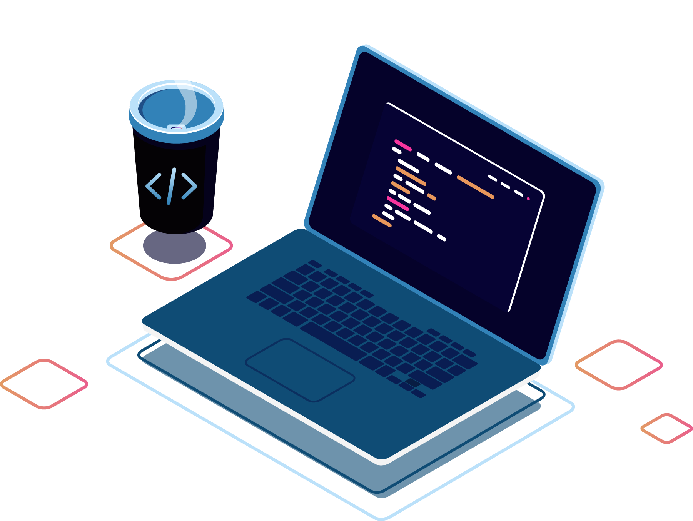

# 💙 Olá, meu nome é Letícia Cabral

- 👉 Hoje trabalho com Front-end Developer & Analista de Sistemas
- 💜 Tenho alguma experiencia com Scrum, metodo BDD(Desenvolvimento orientado por comportamento), Msql, Postgresql.
- 💻 Estudando Power BI e analise de dados.

 
  
  
  

##
##
### 🧰 Skills 

  
  
  
  
  
  
  
  
  
  
  
  
  
  

### **GitHub Estatísticas**

